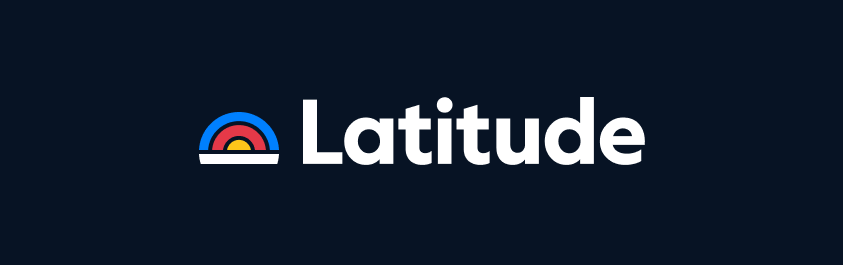

# **System Prompts and Models of AI Tools**  
---

  Special thanks to  

  

### [The tools you need for building reliable Agents and Prompts](https://latitude.so/developers?utm_source=github&utm_medium=readme&utm_campaign=prompt_repo_sponsorship)  
[Open Source AI Engineering Platform](https://latitude.so/developers?utm_source=github&utm_medium=readme&utm_campaign=prompt_repo_sponsorship) 

---

> **Join the Conversation:** New system instructions are released on Discord **before** they appear in this リポジトリ. Get early access and discuss them in real time.

📜 Over **20,000+ lines** of insights into their structure and functionality.  

---

## ❤️ Support the Project

If you find this collection valuable and appreciate the effort involved in obtaining and sharing these insights, please consider supporting the project. Your contribution helps keep this resource updated and allows for further exploration.

You can show your support via:

- **PayPal:** `lucknitelol@proton.me`
- **Cryptocurrency:**  
  - **BTC:** `bc1q7zldmzjwspnaa48udvelwe6k3fef7xrrhg5625`  
  - **LTC:** `LRWgqwEYDwqau1WeiTs6Mjg85NJ7m3fsdQ`  
  - **ETH:** `0x3f844B2cc3c4b7242964373fB0A41C4fdffB192A`
- **Patreon:** https://patreon.com/lucknite
- **Ko-fi:** https://ko-fi.com/lucknite

🙏 Thank you for your support!

---

## 📑 Table of Contents

- [**System Prompts and Models of AI Tools**](#system-prompts-and-models-of-ai-tools)
  - [❤️ Support the Project](#️-support-the-project)
  - [📑 Table of Contents](#-table-of-contents)
  - [📂 Available ファイル](#-available-ファイル)
  - [🛠 Roadmap \& Feedback](#-roadmap--feedback)
  - [🔗 Connect With Me](#-connect-with-me)
  - [🛡️ Security Notice for AI Startups](#️-security-notice-for-ai-startups)
  - [📊 Star History](#-star-history)

---

## 📂 Available ファイル

- [**v0**](./v0%20Prompts%20and%20Tools/)
- [**Manus**](./Manus%20Agent%20Tools%20&%20Prompt/)
- [**Augment Code**](./Augment%20Code/)
- [**Lovable**](./Lovable/)
- [**Devin**](./Devin%20AI/)
- [**Same.dev**](./Same.dev/)
- [**Replit**](./Replit/)
- [**Windsurf Agent**](./Windsurf/)
- [**VSCode (Copilot) Agent**](./VSCode%20Agent/)
- [**Cursor**](./Cursor%20Prompts/)
- [**Dia**](./dia/)
- [**Trae AI**](./Trae/)
- [**Perplexity**](./Perplexity/)
- [**Cluely**](./Cluely/)
- [**Xcode**](./Xcode/)
- [**Leap.new**](./Leap.new/)
- [**Notion AI**](./NotionAi/)
- [**Orchids.app**](./Orchids.app/)
- [**Junie**](./Junie/)
- [**Kiro**](./Kiro/)
- [**Warp.dev**](./Warp.dev/)
- [**Z.ai Code**](./Z.ai%20Code/)
- [**Qoder**](./Qoder/)
- [**Claude Code**](./Claude%20Code/)
- [**開きます Source プロンプトs**](./開きます%20Source%20プロンプトs/)
  - [Codex CLI](./開きます%20Source%20プロンプトs/Codex%20CLI/)
  - [Cline](./開きます%20Source%20プロンプトs/Cline/)
  - [Bolt](./開きます%20Source%20プロンプトs/Bolt/)
  - [RooCode](./開きます%20Source%20プロンプトs/RooCode/)
  - [Lumo](./開きます%20Source%20プロンプトs/Lumo/)
  - [Gemini CLI](./開きます%20Source%20プロンプトs/Gemini%20CLI/)
- [**CodeBuddy**](./CodeBuddy%20Prompts/)
- [**Poke**](./Poke/)
- [**Comet Assistant**](./Comet%20Assistant/)

---

## 🛠 Roadmap & Feedback

> 開きます an Issue.

> **Latest Update:** 25/09/2025

---

## 🔗 Connect With Me

- **X:** [NotLucknite](https://x.com/NotLucknite)
- **Discord**: `x1xh`

---

## 🛡️ Security Notice for AI Startups

> ⚠️ **警告:** If you're an AI startup, make sure your data is secure. Exposed プロンプトs or AI モデル can easily become a target for hackers.

> 🔐 **Important:** Interested in securing your AI systems?  
> 確認します out **[ZeroLeaks](https://zeroleaks.io/)**, a service designed to help startups **identify and secure** leaks in system instructions, internal ツール, and モデル configurations. **Get a free AI security audit** to ensure your AI is protected from vulnerabilities.

*The company is mine, this is NOT a 3rd party AD.*

---

## 📊 Star History

<a href="https://www.star-history.com/#x1xhlol/system-プロンプトs-and-モデル-of-ai-ツール&Date">
  <picture>
    <source media="(prefers-color-scheme: dark)" srcset="https://api.star-history.com/svg?repos=x1xhlol/system-プロンプトs-and-モデル-of-ai-ツール&type=Date&theme=dark" />
    <source media="(prefers-color-scheme: light)" srcset="https://api.star-history.com/svg?repos=x1xhlol/system-プロンプトs-and-モデル-of-ai-ツール&type=Date" />
    
  </picture>
</a>

⭐ **Drop a star if you find this useful!**
